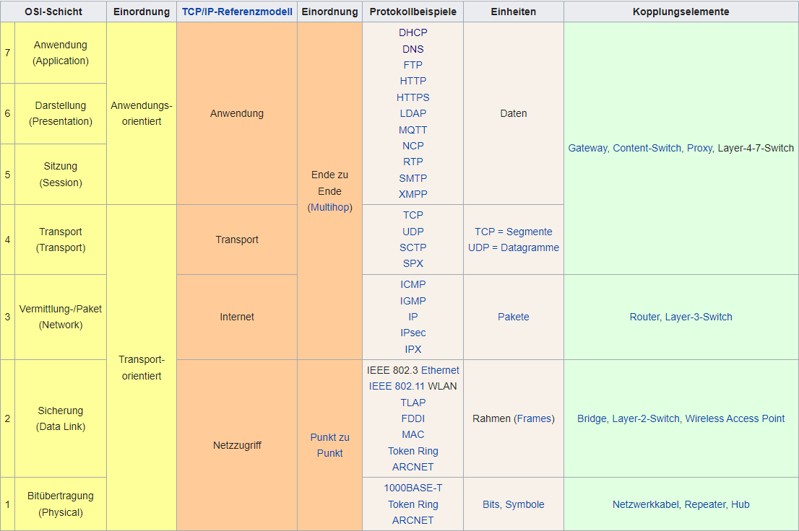

# Table of Content
- [Table of Content](#table-of-content)
- [Schnittstellen](#schnittstellen)
  - [REST (Representational State Transfer)](#rest-representational-state-transfer)
  - [API (Application Programming Interface)](#api-application-programming-interface)
- [Protokolle](#protokolle)
  - [SOAP (Simple Object Access Protocol)](#soap-simple-object-access-protocol)
- [Architektur](#architektur)
  - [CORBA (Common Object Request Broker Architecture)](#corba-common-object-request-broker-architecture)
  - [COM/DCOM (Distributed / Component Object Model)](#comdcom-distributed--component-object-model)
  - [MVC (Model-View-Controller)](#mvc-model-view-controller)
- [Auszeichnungssprachen](#auszeichnungssprachen)
  - [DTD (Document Type Definition)](#dtd-document-type-definition)
  - [XSL](#xsl)
- [UML (Unified Modelling Language)](#uml-unified-modelling-language)
- [Paradigmen](#paradigmen)
  - [OOA (Object Oriented Analysis)](#ooa-object-oriented-analysis)
  - [OOD (Object Oriented Design)](#ood-object-oriented-design)
  - [OOP (Object Oriented Programming)](#oop-object-oriented-programming)
- [Herangehensweisen](#herangehensweisen)
  - [CI (Continuos Integration)](#ci-continuos-integration)
  - [CD (Continuos Delivery / Deployment)](#cd-continuos-delivery--deployment)
  - [Scrum](#scrum)
- [Wirtschaft](#wirtschaft)
  - [GP (Geschäftsprozesse)](#gp-geschäftsprozesse)
  - [BAB (Bietriebsablaufbogen)](#bab-bietriebsablaufbogen)
  - [EPK (Ereignisgesteuerte Prozessketten)](#epk-ereignisgesteuerte-prozessketten)
- [Sandboxing](#sandboxing)
- [Netzwerke](#netzwerke)
  - [LAN (Local Area Network)](#lan-local-area-network)
  - [WAN (Wide Area Network)](#wan-wide-area-network)
  - [MAN (Metropolitan Area Network)](#man-metropolitan-area-network)
  - [WLAN (Wireless Local Area Network)](#wlan-wireless-local-area-network)
  - [NIC (Network Interface Controller)](#nic-network-interface-controller)
  - [CIDR (Classless Inter-Domain Routing)](#cidr-classless-inter-domain-routing)
  - [DHCP (Dynamic Host Protocol)](#dhcp-dynamic-host-protocol)
  - [WPAD (Web Proxy Audodiscovery Protocol)](#wpad-web-proxy-audodiscovery-protocol)
  - [DNS (Domain Name System)](#dns-domain-name-system)
  - [ISO/OSI-Referenzmodell](#isoosi-referenzmodell)
    - [Schicht 1 - Bitübertragungsschicht (Physical Layer)](#schicht-1---bitübertragungsschicht-physical-layer)
    - [Schicht 2 - Sicherungsschicht (Data Link Layer)](#schicht-2---sicherungsschicht-data-link-layer)
    - [Schicht 3 - Vermittlungsschicht (Network Layer)](#schicht-3---vermittlungsschicht-network-layer)
    - [Schicht 4 - Transportschicht (Transport Layer)](#schicht-4---transportschicht-transport-layer)
    - [Schicht 5 - Sitzungsschicht (Session Layer)](#schicht-5---sitzungsschicht-session-layer)
    - [Schicht 6 - Darstellungsschicht (Presentation Layer)](#schicht-6---darstellungsschicht-presentation-layer)
    - [Schicht 7 - Anwendungsschicht (Application Layer)](#schicht-7---anwendungsschicht-application-layer)

---
 

# Schnittstellen

## REST (Representational State Transfer)
- Paradigma für die Softwarearchitektur
- Der Schwerpunkt von REST liegt hauptsächlich auf Maschine zu Maschine Kommunikation.
- Rest stellt eine einfache Alternative zu SOAP und WSDL und dem verwantem RPC dar.
- Die Bezeichnung „Representational State Transfer“ soll den Übergang vom aktuellen Zustand zum nächsten Zustand (state) einer Applikation verbildlichen. Dieser Zustandsübergang erfolgt durch den Transfer der Daten, die den nächsten Zustand repräsentieren

## API (Application Programming Interface)
- Schafft die Möglichkeit dass zwei oder mehrere Computer Pogramme miteinander Kommunizieren können.
 

# Protokolle

## SOAP (Simple Object Access Protocol)
[^2] 
- Netzwerkprotokoll
- SOAP ist ein industrieller Standart des World Wide Web Consortiums (W3C)
- SOAP stützt sich auf XML zur Repräsentation der Daten und auf Internet-Protokolle der Transport- und Anwendungsschicht (vgl. TCP/IP-Referenzmodell) zur Übertragung der Nachrichten.
- Gängigste Kombination ist SOAP über HTTP und TCP
 

# Architektur

## CORBA (Common Object Request Broker Architecture)

## COM/DCOM (Distributed / Component Object Model)

## MVC (Model-View-Controller)
 

# Auszeichnungssprachen

## DTD (Document Type Definition)
[^4] 
- Eine DTD beschreibt die Struktur und die Elemente eines XML Dokuments
 

## XSL

# UML (Unified Modelling Language)

# Paradigmen
 

## OOA (Object Oriented Analysis)
Bei der Object Oriented Analysis werden die Anforderungen an das System in Form von Szenarien, Anwendungsfällen oder Benutzergeschichten erfasst. Anschließend werden die Objekte identifiziert, die in diesem System eine Rolle spielen, und deren Eigenschaften und Verhalten beschrieben. Dabei werden Konzepte wie Klassen, Attribute, Methoden, Beziehungen und Vererbung verwendet.

Das Ziel der Object Oriented Analysis besteht darin, ein klares Verständnis des Systems zu entwickeln und die Anforderungen in eine objektorientierte Struktur zu überführen. Die Ergebnisse der OOA dienen als Grundlage für das Object Oriented Design, bei dem die strukturellen und verhaltensbezogenen Aspekte der Softwareentwicklung weiter ausgearbeitet werden.

Durch die Verwendung von OOA können komplexe Systeme besser abstrahiert, organisiert und modelliert werden, was zu einer besseren Wartbarkeit, Flexibilität und Wiederverwendbarkeit des Codes führen kann.

## OOD (Object Oriented Design)
Das Object Oriented Design bezieht sich auf den Prozess der Gestaltung einer Softwareanwendung unter Verwendung der Prinzipien der Objektorientierung. Dabei werden die Anforderungen analysiert, das System in verschiedene Objekte aufgeteilt und deren Beziehungen zueinander definiert.

## OOP (Object Oriented Programming)
[^7] 
Die objektorientierte Programmierung ist ein auf dem Konzept der Objektorientierung basierendes Programmierparadigma. Die Grundidee besteht darin, die Architektur einer Software an den Grundstrukturen desjenigen Bereichs der Wirklichkeit auszurichten, der die gegeben Anwendung betrifft.
[^3]
 

# Herangehensweisen
## CI (Continuos Integration)
Continous Integration bezieht sich auf den Prozess bei dem Entwickler regelmäßig ihre Codeänderungen in ein gemeinsames Repository hochladen. Jedes Mal, wenn Code in das Repository eingecheckt wird, wird eine automatische Build und Testpipeline ausgelöst. Der Zweck darin besteht Probleme frühzeitig zu erkennen, Konflikte zwischen Entwicklern zu vermeiden und die Qualität des Codes kontinuirlich zu verbessern.

## CD (Continuos Delivery / Deployment)
CD baut auf CI auf und beinhaltet die automatische Bereitstellung und Auslieferung der Anwendung nach erfolgreichem Abschluss der CI-Phase. Bei Continous Delivery wird die Software automatisch in eine Umgebung (z.B. Staging oder Testumgebung) bereitgestellt, in der weitere Tests und Überprüfungen durchgeführt werden können. Bei Continous Deplyment wird die Software automatisch in die Produktionsumgebung bereitgestellt und ist für Benutzer verfügbar.

## Scrum

# Wirtschaft

## GP (Geschäftsprozesse)
- Zusammenhängende Folgen von Aktivitäten/Tätigkeiten, für die ein oder mehrere Inputs benötigt werden und die dann der Erreicherung von Unternehmenszielen dienen.

## BAB (Bietriebsablaufbogen)

## EPK (Ereignisgesteuerte Prozessketten)
 

# Sandboxing
[^1] 
Sandbox ist die englischsprachige Bezeichnung für Sandkiste oder Sandkasten und bezeichnet allgemein einen isolierten Bereich, innerhalb dessen jede Maßnahme keine Auswirkung auf die äußere Umgebung hat.

# Netzwerke
## LAN (Local Area Network)
LAN bezieht sich auf ein Computernetzwerk, das auf einen relativ kleinen geografischen Bereich wie ein Bürogebäude, eine Schule oder eine Campusumgebung beschränkt ist. Ein LAN ermöglicht die Vernetzung von Computern, Geräten und Ressourcen innerhalb dieses begrenzten Bereichs.

In einem LAN können Geräte wie Computer, Laptops, Drucker, Server, Netzwerkswitches und Router miteinander verbunden werden. Die Verbindung erfolgt normalerweise über ein Ethernet-Kabel oder drahtlose Verbindung wie Wi-Fi.

## WAN (Wide Area Network)
WAN bezieht sich auf ein Computernetzwerk, das sich über größere geografische Entfernung erstreckt. Ein WAN umfasst in der Regel mehrere LANs, die miteinander verbunden sin, um eine weitreichende Kommunikation zu ermöglichen. Es verwendet verschiedene Kommunikationstechnologien und Übertragungsmedien wie Telefonleitungen, Glasfaserkabel, Satellitenverbindung oder drahtlose Verbindung, um die Datenübertragung zwischen den Standorten zu ermöglichen.

## MAN (Metropolitan Area Network)
MAN bezieht sich auf ein Computernetzwerk, das eine Stadt oder eine Metropolregion abdeckt.

## WLAN (Wireless Local Area Network)
WLAN bezieht sich auf eine drahtlose Netzwerktechnologie, die es Geräten ermöglicht zu kommunizieren ohne das eine physische Kabelverbindung erforderlich ist.  
WLAN basiert auf dem Standard IEEE 802.11 und verwendet Funkwellen, um Daten zwischen Geräten zu übertragen.

## NIC (Network Interface Controller)
[^6] 
Die NIC ist die Netzwerkkarte oder auch Netzwerkadapter eines Computers.

## CIDR (Classless Inter-Domain Routing)
[^5] 
Classless Inter-Domain Routing beschreibt ein Verfahren zur effizienteren Nutzung des bestehenden 32-Bit-IP-Adress-Raumes für IPv4.

## DHCP (Dynamic Host Protocol)
Siehe [DHCP](/Netzwerktechnik.md/#dhcp)

## WPAD (Web Proxy Audodiscovery Protocol)
[^9] 
Das Web Proxy Auto-Discovery Protocol ist ein Protokoll, mit dem Web-Clients zu verwendende Web-Proxys innerhalb eines Computernetzwerkes automatisch finden können, indem iene Proxy autoconfiguration-Datei unter einer erratbaren URL gespeichert wird.

## DNS (Domain Name System)
[^8] 
Das Domain Name System, ist ein hierarchisches unterteiltes Bezeichnungssystem in einem meist IP-basierten Netz zur Beantwortung von Anfragen zu Domain-Namen (Namenauflösung)

## ISO/OSI-Referenzmodell
[^10] 
### Schicht 1 - Bitübertragungsschicht (Physical Layer)
### Schicht 2 - Sicherungsschicht (Data Link Layer)
### Schicht 3 - Vermittlungsschicht (Network Layer)
### Schicht 4 - Transportschicht (Transport Layer)
### Schicht 5 - Sitzungsschicht (Session Layer)
### Schicht 6 - Darstellungsschicht (Presentation Layer)
### Schicht 7 - Anwendungsschicht (Application Layer)

 

[^1]: https://de.wikipedia.org/wiki/Sandbox
[^2]: https://de.wikipedia.org/wiki/SOAP
[^3]: https://de.wikipedia.org/wiki/Objektorientierte_Programmierung
[^4]: https://de.wikipedia.org/wiki/Dokumenttypdefinition
[^5]: https://de.wikipedia.org/wiki/Classless_Inter-Domain_Routing
[^6]: https://de.wikipedia.org/wiki/Netzwerkkarte
[^7]: https://de.wikipedia.org/wiki/Objektorientierte_Programmierung
[^8]: https://de.wikipedia.org/wiki/DNS
[^9]: https://de.wikipedia.org/wiki/Web_Proxy_Autodiscovery_Protocol
[^10]: https://de.wikipedia.org/wiki/OSI-Modell