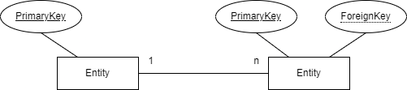

# Table of Content
- [Table of Content](#table-of-content)
- [Normalformen](#normalformen)
  - [1. Normalform](#1-normalform)
    - [Erläuterung](#erläuterung)
    - [Beispiel](#beispiel)
    - [Mögliche Fehler](#mögliche-fehler)
      - [Einfüge-Anomalie](#einfüge-anomalie)
      - [Änderungs-Anomalie](#änderungs-anomalie)
      - [Lösch-Anomalie](#lösch-anomalie)
  - [2. Normalform](#2-normalform)
    - [Erläuterung](#erläuterung-1)
    - [Beispiel](#beispiel-1)
    - [Mögliche Fehler](#mögliche-fehler-1)
      - [Änderungs-Anomalie](#änderungs-anomalie-1)
  - [3. Normalform](#3-normalform)
    - [Erläuterung](#erläuterung-2)
    - [Beispiel](#beispiel-2)
    - [Mögliche Fehler](#mögliche-fehler-2)
- [Beziehungen](#beziehungen)
  - [1:1 Beziehung](#11-beziehung)
  - [1:n Beziehung](#1n-beziehung)
  - [n:m Beziehung](#nm-beziehung)
- [SQL](#sql)
  - [Sprachelemente](#sprachelemente)
  - [SELECT-Abfragen](#select-abfragen)
    - [Einfache Abfrage](#einfache-abfrage)
    - [Abfrage mit Spaltenauswahl(,)](#abfrage-mit-spaltenauswahl)
    - [Abfrage mit einduetigen Werten (DISTINCT)](#abfrage-mit-einduetigen-werten-distinct)
    - [Abfrage mit Umbenennung (AS)](#abfrage-mit-umbenennung-as)
    - [Abfrage mit Filter (WHERE)](#abfrage-mit-filter-where)
    - [Abfrage mit Filter nach Inhalt (WHERE ... LIKE ...)](#abfrage-mit-filter-nach-inhalt-where--like-)
    - [Abfrage mit Filter und Sortierung (ORDER BY)](#abfrage-mit-filter-und-sortierung-order-by)
    - [Abfrage mit verknüpften Tabellen (, und INNER JOIN)](#abfrage-mit-verknüpften-tabellen--und-inner-join)
    - [Linker äußerer Verbund (LEFT OUTER JOIN)](#linker-äußerer-verbund-left-outer-join)
    - [Gruppieren von Aggregat-Funktionen (GROUP BY)](#gruppieren-von-aggregat-funktionen-group-by)
    - [Zusammenfassung eines SELECT](#zusammenfassung-eines-select)
  - [INSERT-Abfragen (Einfügen von Datensätzen)](#insert-abfragen-einfügen-von-datensätzen)
  - [Ändern von Datensätzen (UPDATE)](#ändern-von-datensätzen-update)
  - [Löschen von Datensätzen (DELETE)](#löschen-von-datensätzen-delete)
  - [SQL-Datentypen](#sql-datentypen)

---
<br>

# Normalformen
[^2] [^1]<br>
Zurzeit gebräuchliche Normalformen sind:
- 1 Normalform (1NF)
- 2 Nromalform (2NF)
- 3 Normalform (3NF)
- Boyce-Codd-Normalform (BCNF) [Wird hier nicht besprochen]
- 4 Normalform (4NF) [Wird hier nicht besprochen]
- 5 Normalform (5NF) [Wird hier nicht besprochen]

## 1. Normalform
### Erläuterung
Jedes __Attribut__ der __Relation__ muss einen atomaren Wertebereich haben, und die Relation muss frei von Wiederholungen sein.<br>
Das heißt, dass pro Datenfeld nur maximal ein Wert enthalten sein darf.

### Beispiel
__0. Normalform__
<br>
<a href="https://info-wsf.de/Normalformen/">
  
</a>
<br>
Im oberen Beispiel werden mehrere Daten in einem Datenfeld gespeichert. Dies wird auch die 0. Normalform oder NF² (Non-First-Normal-Form) genannt.<br>
Datensätze aus dieser Tabelle können hier nicht einzelnd entnommen werden. Möchte man z.B. PrüfFachNr von Meier bekommen, bekommt man "10", "12" und "16".
In der Definition heißt es: "...maximal einen Wert...", was einem in der 1. Normalform erlaubt Null-Werte einzutragen, wenn man z.B. noch nicht vergeben Punkte in einem Kurs.
<br>

Es gibt zwei Arten Mehrfachattribute zu beseitigen:
1. Das Mehrfachattribut wird innerhalb des Datensatzes in mehrere Einfachattribute zerlegt, d.h. der Datensatz erhält mehr Attribute.
2. Wenn das Mehrfachattribut eine Liste von typgleichen Daten enthält, wird jedem Wert der Liste einen eigenem Datensatz zugeordnet.

Das Ergebnis könnte so aussehen:
<br>
<a href="https://info-wsf.de/Normalformen/">
  
</a>
<br>

### Mögliche Fehler
#### Einfüge-Anomalie
1. Zur bestehenden Prüfungsnummer erfolgt ein weiterer Eintrag mit anderer Prüffachbezeichnung.
2. Zur selben Matrikelnummer erfolgt ein Eintrag mit anderem Studentennamen.
3. Der Eintrag eines Studenten, der noch kein Prüfungsfach gewählt hat, liefert Nullwerte in der Prüfungsfachnummer, da dies aber Teil des Primärschlüssels ist, darf dies nicht sein. Es verletzt die Integrität.

#### Änderungs-Anomalie
4. Wenn der Name des Professors sich ändert, muss dies in allen Zeilen geschehen.
5. Den einzelnen Prüfungsfächern werde neue Prüfer zugeordnet. Überall.

#### Lösch-Anomalie
- Einige Daten könnten verloren gehen wenn ein Tupel gelöscht wird.

## 2. Normalform
### Erläuterung
Eine Relation ist dann in der zweiten Normalform wenn die erste Normalform erreicht wurde und kein Nichtprimärattribut funktionial von einer echten Teilmenge eines Schlüsselkandidaten abhängt.

### Beispiel
Wir müssen die Tabelle aus dem Beispiel der ersten Normalform aufteilen, da weder der Name des Studenten noch die Bezeichnung des Prüfungsfach voll vom Pirmärschlüssel abhängig sind. Das Attribut Note ist voll vom Primäschlüssel abhängig und bleibt in der Relation.<br>
So ergibt sich folgende Realtionen in der zweiten Normalform.

<br>
<a href="https://info-wsf.de/Normalformen/">
  
</a>
<br>

In allen entstandenen Relationen sind alle Nicht-Primärschlüssel-Attribute voll funktional abhängig von den jeweiligen Primärschlüsseln.

### Mögliche Fehler
#### Änderungs-Anomalie
4. Wenn der Name des Professors sich ändert, muss dies in allen Zeilen geschehen.

## 3. Normalform
### Erläuterung
Eine Relation befindet sich in der dritten Normalform, wenn die zweite Normalform erfüllt ist und keine Abhängigkeiten der Nichtschlüssel-Attribute untereinander bestehen. Solche Abhängigkeiten bezeichnet man auch als __transitive__ Abhängigkeiten. Weiterhin müssen alle Nichtschlüssel voll funktional abhängig vom Schlüsselattribut sein.
<br>

### Beispiel
Durch die Überführung in die zweite Normalform haben wir Redundanzen weitgehend beseitigt, jedoch fällt auf, dass das Attribut "ProfName" mehrmals vorkommt. obwohl mit ProfNr der Name des Professors schon gegeben wäre. Dies können wir mit der Überführung in die dritte Normalform beseitigen.

<br>
<a href="https://info-wsf.de/Normalformen/">
  
</a> 
<br>

### Mögliche Fehler
Nun sind alle Anomalien / Redundanzen beseitigt.

# Beziehungen
[^3]
## 1:1 Beziehung
In einer **"eins zu eins"-Beziehung in relationalen Datenbanken** ist jeder Datensatz in Tabelle A genau einem Datensatz in Tabelle B zugeordnet und umgekehrt. Diese Art von Beziehung sollte in der Modellierung vermieden werden, weil die meisten Informationen, die auf diese Weise in Beziehung stehen, sich in einer Tabelle befinden können. Eine 1:1-Beziehung verwendet man nur, um eine Tabelle aufgrund ihrer Komplexität zu teilen oder um einen Teil der Tabelle aus Gründen der Zugriffsrechte zu isolieren.


## 1:n Beziehung
Eine **"eins zu viele"-Beziehung in relationalen Datenbanken** ist der häufigste Beziehungstyp in einer Datenbank. In einer **1:n-Beziehung** können einem Datensatz in Tabelle A mehrere passende Datensätze in Tabelle B zugeordnet sein, aber einem Datensatz in Tabelle B ist nie mehr als ein Datensatz in Tabelle A zugeordnet.



## n:m Beziehung
Bei **"viele zu viele"-Beziehungen in relationalen Datenbanken** können jedem Datenstz in Tabelle A mehrere passende Datensätze in Tabelle B zugeordnet sein und umgekehrt. Diese Beziehung können nur über eine dritte Tabelle, eine Verbindungstabelle C, realisiert werden. Die Verbindungstabelle C enthält in der Regel nur die Fremdschlüssel der beiden anderen Tabellen (A/B). Der Primärschlüssel der Verbindungstabelle wird aus diesen beiden Fremschlüsseln gebildet. Daraus folgt das eine m:n Beziehung in Wirklichkeit zwei 1:n Beziehungen sind.


# SQL
[^4]
SQL steht für Structured Query Language und ist eine Datenbanksprache zur Definition von Datenstrukturen in relationalen Datenbanken so wie zum Bearbeiten (Einfügen, Verändern, Löschen) von Abfragen von darauf basierten Datenbeständen.

## Sprachelemente
SQL-Befehle lassen sich in fünf Kategorien unterteilen.
- Data Query Language (DQL):
  - Befehle zur Abfrage und Aufbereitung der gesuchten Informationen, wird auch als Untermenge der DML Klassifiziert.
- Data Manipulation Language (DML):
  - Befehle zur Datenmanipulation (Ändern, Einfügen, Löschen von Datensätzen) und ledendem Zugriff.
- Data Definition Language (DDL):
  - Befehle zur Definition des Datenbankschemas (Erzeugen, Ändern, Löschen von Datenbanktabellen, Definition vom Schlüsseln).
- Data Control Language (DCL):
  - Befehle für die Rechteverwaltung.
- Transaction Control Language (TCL):
  - Befehle für die Transaktionskontrolle.

Die Bezeichnung SQL bezieht sich auf das englische Wort "query" (deutsch: "Abfrage").

## SELECT-Abfragen
Beispiel Datenbank:
<a href="https://de.wikipedia.org/wiki/SQL">
  
</a>

### Einfache Abfrage

```sql
SELECT * FROM Student;
```
Ergebnis:

|MatrNr|Name|
|---|---|
|26120|Fichte|
|25403|Jonas|
|27103|Fauler|

listet alle Spalten und alle Zeilen der Tabelle `Student` auf.

### Abfrage mit Spaltenauswahl(,)

```sql
SELECT VorlNr, Titel FROM Vorlesung;
```
Ergebnis:

|VorlNr|Titel|
|---|---|
|5001|ET|
|5022|IT|
|5045|DB|

litet alle Spalten `VorlNr` und `Titel` aller Zeilen der Tabelle `Vorlesung` auf.

### Abfrage mit einduetigen Werten (DISTINCT)

```sql
SELECT DISTINCT MatrNr FROM hoert;
```
Ergebnis:

|MatrNr|
|---|
|25403|
|26120|

listet nur unterschiedliche Einträge der Spalte `MatrNr` aus der Tabelle `hoert` auf. Dies zeigt die Matrikelnummern aller Studenten, die mindestens eine Vorlesung haben, wobei mehrfach auftretende Matrikelnummern nur einmal ausgegeben werden.

### Abfrage mit Umbenennung (AS)

```sql
SELECT MatrNr AS Matrikelnummer, Name FROM Student;
```
Ergebnis:

|Matrikelnummer|Name|
|---|---|
|26120|Fichte|
|25403|Jonas|
|27103|Fauler|

listet die Spalten `MatrNr` und Name aller Zeilen der Tabelle `Student` auf. `MatrNr` wird beim Anzeigeergebnis als Matrikelnummer aufgeführt.

### Abfrage mit Filter (WHERE)

```sql
SELECT VorlNR, Titel FROM Vorlesung WHERE Titel = 'ET';
```
Ergebnis:

|VorlNr|Titel|
|---|---|
|5001|ET|

listet `VorlNr` und `Titel` aller derjenigen Zeilen der Tabelle auf, deren Titel `ER` ist.

### Abfrage mit Filter nach Inhalt (WHERE ... LIKE ...)

```sql
SELECT Name FROM Student WHERE Name LIKE 'F%';
```
ERgebnis:

|Name|
|---|
|Fichte|
|Fauler|

listet die Namen aller Studenten auf, deren Name mit `F` beginnt. `LIKE` kann mit verschiedenen Platzhaltern verwendet werden: `_` steht für einzelnes beliebiges Zeichen, `%` steht für eine beliebige Zeichenfolge.

### Abfrage mit Filter und Sortierung (ORDER BY)

```sql
SELECT Vorname, Name, StrasseNr, Plz, Ort FROM Student WHERE Plz = '20095' ORDER BY Name;
```

listet `Vorname`, `Name`, `StrasseNr`, `Plz` und `Ort` aller Studenten aus dem angegebenen Postleitzahlbereich aufsteigend sortiert nach `Name` auf.

### Abfrage mit verknüpften Tabellen (, und INNER JOIN)

```sql
SELECT Vorlesung.VorlNr, Vorlesung.Titel, Professor.PersNr, Professor.Name FROM Professor, Vorlesung WHERE Professor.PersNr = Vorlesung.PersNr;
```

Die Aufzählung hinter `FROM` legt die Datenquellen fest: an dieser Stelle können mit Hilfe sogenannter `JOIN`s mehrere Tabellen miteinander verknüpft werden, so dass Daten aus verschiedenen Tabellen zusammengeführt und angezeigt werden.

In diesem Beispiel wird ein „innerer natürlicher Verbund“ `(NATURAL INNER JOIN)` verwendet: Alle Datensätze aus den Tabellen `Professor` und `Vorlesung`, die den gleichen Wert im Feld `PersNr` haben. Professoren ohne Vorlesung und Vorlesungen ohne Professor werden damit nicht angezeigt.

Diese Abfrage ist äquivalent zu:

```sql
SELECT Vorlesung.VorlNr, Vorlesung.Titel, Vorlesung.PersNr, Professor.Name FROM Professor INNER JOIN Vorlesung ON Professor.PersNr = Vorlesung.PersNr;
```

Tabellen können nicht nur über Schlüsselfelder, sondern über beliebige Felder miteinander verknüpft werden, wie das folgende, fachlich unsinnige Beispiel zeigt:

```sql
SELECT Vorlesung.Titel, Professor.Name FROM Professor, Vorlesung WHERE Professor.Name <> Vorlesung.Titel;
```
Ergebnis:

|Titel|Name|
|---|---|
|ET|Tesla|
|ET|Wirth|
|ET|Urlauber|
|IT|Tesla|
|IT|Wirth|
|IT|Urlauber|
|DB|Tesla|
|DB|Wirth|
|DB|Urlauber|

Das Ergebnis erhält die Kombinationen aller Professoren und aller Vorlesungen, wo der Name des Professors vom Titel der Vorlesung abweicht – das sind einfach alle (keine Vorlesung heißt wie ein Professor)

### Linker äußerer Verbund (LEFT OUTER JOIN)

```sql
SELECT Rrofessor.PersNr, Professor.Name, Vorlesung.VorlNr, Vorlesung.Titel FROM Professor LEFT OUTER JOIN Vorlesung ON Professor.PersNr = Vorlesung.PersNr;
```

Ergibt alle Datensätze der Tabelle `Professor` verbunden mit den Datensätzen der Tabelle `Vorlesung`, die den jeweils gleichen Wert im Feld `PersNr` haben. Professoren ohne Vorlesung sind enthalten, die Vorlesungsspalten im Ergebnis haben dann den Wert `NULL`. Vorlesungen ohne Professor sind nicht enthalten.

Die folgende Abfrage liefert nur diejenigen Datensätze, zu denen kein passender Datensatz im linken äußeren Verbund existiert (alle Professoren, die keine Vorlesungen halten):

```sql
SELECT Professor.PersNr, Professor.Name FROM Professor LEFT OUTER JOIN Vorlesung ON Professor.PersNr = Vorlesung.PersNr WHERE Vorlesung.PersNr IS NULL;
```

Das gleiche kann mittels einer Unterabfrage erreicht werden:

```sql
SELECT Professor.PersNr, Professor.Name FROM Professor WHERE NOT EXISTS (SELECT * FROM Vorlesung WHERE PersNr = Professor.PersNr);
```

### Gruppieren von Aggregat-Funktionen (GROUP BY)

```sql
SELECT Professor.PersNr, Professor.Name, COUNT(Vorlesung.PersNr) AS Anzahl FROM Professor LEFT OUTER JOIN Vorlesung ON Professor.PersNr = Vorlesung.PersNr GROUP BY Professor.Name, Professor.PersNr;
```

Zählt die Anzahl der Vorlesungen pro Professor mit Hilfe der Aggregat-Funktion `COUNT`.

Bemerkung: `COUNT(Professor.PersNr)` oder `COUNT(*)` wären falsch (`NULL`-Werte sollen nicht mitgezählt werden).

### Zusammenfassung eines SELECT

**Erläuterung:**

- **DISTINCT:**
  - Gibt an, dass aus der Ergebnisrelation gleiche Ergebnistupel entfernt werden sollen. Es wird also jeder Datensatz nureinmal ausgegeben, auch wenn er mehrfach in der Tabelle vorkommt. Sonst liefert SQL eine Multimenge zurück.
- **Auswahlliste:**
  - Bestimmt, welche Spalten der Quelle auzugeben sind (* für alle) und ob Aggregatfunktionen anzuwenden sind. Wie bei allen anderen Aufzählungen werden die einzelnen Elemente mit Komma (,) voneinander getrennt.
- **Quelle:**
  - Gibt an, wo die Daten herkommen. Es können Relationen und Sichten angegeben werden und miteinander als kertesisches Produkt oder als Verbund (JOIN, ab SQL-92) verknüpft werden. Mit der zusätzlichen Angaben eines Namens können Relationen für die Abfrage umbenannt werden.
- **WHERE-Klausel:**
  - Bestimmt Bedingungen, auch Filter genannt, unter denen die Daten ausgegeben werden sollen. In SQL ist hier auch die Angabe von Unerabfragen möglich, so dass SQL streng relational vollständig wird.
- **GROUP BY-Attribut:**
  - Legt fest, ob unterschiedliche Werte als einzelne Zeilen ausgegeben werden sollen (GROUP BY = Gruppierung) oder aber die Feldwerte der Zeilen durch Aggregationen wie Addition (`SUM`), Durchschnitt (`AVG`), Minimum (`MIN`), Maximum (`MAX`) zu einem Ergebniswert zusammengefasst werden, der sich auf die Gruppierung bezieht.
- **HAVING-Klausel:**
  - Ist wie die `WHERE`-Klausel, nur dass sich die angegebene Bedingung auf das Ergebnis einer Aggregationsfunktion bezieht, zum Beispiel `HAVING SUM (Betrag) > 0`.
- **Sortierungsattribut:**
  - Nach `ORDER BY` werden Attribute angegeben, nach denen sortiert werden soll. Die Standardvoreinstellung ist `ASC`, das bedeutet aufsteigende Sortierung, `DESC` ist absteigende Sortierung.

**Mengenoperatoren** können auf mehrere `SELECT`-Abfragen angewandt werden, die gleich viele Attribute haben und bei denen die Datentypen der Attribute übereinstimmen:

- **UNION:**
  - Vereinigt die Ergebnismengen. In einigen Implementierungen werden mehrfach vorkommende Ergebnistupel wie bei `DISTINCT` entfernt, ohne dass `UNTION DISTINCT` geschrieben werden muss beziehungsweise darf.
- **UNTION ALL:**
  - Vereinigt die Ergebnismengen. Mehrfach vorkommende Ergebnistupel beliben erhalten. Einige Implementierungen interpretieren aber `UNION` wie `UNION ALL` und verstehen das `ALL` möglicherweise nicht und geben eine Fehlermeldung aus.
- **EXCEPT:**
  - Liefert die Tupel, die in einer ersten, jedoch nicht in einer zweiten Ergebnismenge enthalten sind. Mehrfach vorkommende Ergebnistupel werden entfernt.
- **MINUS:**
  - Ein analoger Operator wie `EXCEPT`, der von manchen SQL-Dialekten alternativ benutzt wird.
- **INTERSECT:**
  - Liefert die Schnittmenge zweier Ergebnismengen. Mehrfach vorkommende Ergebnistupel werden entfernt.


## INSERT-Abfragen (Einfügen von Datensätzen)

```sql
INSERT INTO Vorlesung (VorlNr, Titel, PersNr) VALUES (1000, 'Softwareentwicklung 1', 12);
```

## Ändern von Datensätzen (UPDATE)

```sql
UPDATE Vorlesung SET VorlNr = VorlNr + 1000, PersNr = 20 WHERE PersNr = 15;
```

ändert alle Datensätze, für die PersNr den Wert 15 hat. Der Wert von `VorlNr` wird um 1000 erhöht und der Wert von PersNr auf 20 gesetzt.

## Löschen von Datensätzen (DELETE)

```sql
DELETE FROM Vorlesung WHERE PersNr = 12;
```

löscht alle Datensätze, für die PersNr den Wert 12 hat.

## SQL-Datentypen

- **INTEGER:**
  - Ganze Zahl (positiv oder negativ), wobei je nach Zahl der verwendeten Bits Bezeichnungen wie `SMALINT`, `TINYINT` oder `BIGINT` verwendet werden.
- **NUMERIC(n, m) oder DECIMAL(n, m):**
  - Festkommazahl (positiv oder negativ) mit insgesamt n Stellen, davon m Nachkommastellen.
- **FLOAT(m):**
  - Gleitkommazahl (positiv oder negativ) mit maximal m Nachkommastellen
- **REAL:**
  - Gleitkommazahl (positiv oder negativ). Die Genauigkeit für diesen Datentyp ist jeweils vom Datenbanksystem definiert.
- **DOUBLE oder DOUBLE PRECISION:**
  - Gleitkommazahl (positiv oder negativ). Die Genauigkeit ist jeweils vom Datenbanksystem definiert.
- **FLOAT UND DOUBLE:**
  - Sind für technisch-wissenschaftliche Werte geeignet und umfassen auch die Exponentialdarstellung. Wegen der Speicherung im Binärformat sind sie aber für Geldbeträge nicht geeignet, weil sich beispielsweise der Wert 0,10€ (entrspricht 10 Cent) nichte exakt abbilden lässt.
- **CHARACTER (n) oder CHAR (n):**
  - Zeichenkette Text mit n Zeichen.
- **TEXT:**
  - Zeichenkette (zumindest theoretisch) beliebiger Länge. In manchen Systemen synonym zu `CLOB`.
- **DATE:**
  - Datum ohne Zeitangabe
- **TIME:**
  - Zeitangabe (evtl. inklusive Zeitzone)
- **TIMESTAMP:**
  - Zeitstempel (umfasst Datum und Uhrzeit; evtl. inklusive Zeitzone), meistens mit Millisekundenauflösung, teilweise auch mikrosekundengenau.
- **Boolean:**
  - Boolesche Variable (kann die Werte true oder false oder NULL annehmen). Dieser Datentyp ist laut SQL:2003 optional und nicht alle DBMS stellen diesen Datentypen bereit.
- **BLOB (n) oder BINARY LARGE OBJECT (n):**
  - Binärdaten von maximal n Bytes Länge.
- **CLOB (n) oder CHARACTER LARGE OBJECT (n):**
  - Zeichenkette mit maximal n Zeichen Länge.

[^1]: https://de.wikipedia.org/wiki/Normalisierung_(Datenbank)#Normalformen
[^2]: https://info-wsf.de/Normalformen/
[^3]: https://www.datenbanken-verstehen.de/datenmodellierung/beziehungen-datenbanken/
[^4]: https://de.wikipedia.org/wiki/SQL