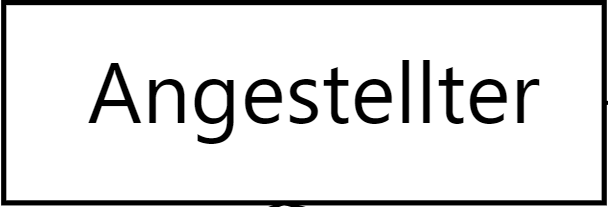
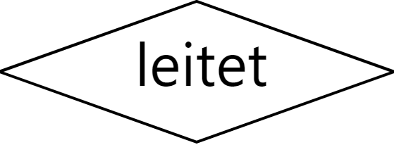

# Table of Content
- [Table of Content](#table-of-content)
- [Entity-Relationship-Modell](#entity-relationship-modell)
  - [Grundlegende Komponenten](#grundlegende-komponenten)

# Entity-Relationship-Modell
[^1] 
Das Entity-Relationship-Modell - kurz ER-Modell oder ERM, dient dazu im Rahmen der semeantischen Datenmodellierung den in einem gegeben Kontext relevanten Ausschnitt der realen Welt zu bestimmen und darzustellen.

## Grundlegende Komponenten
- Entität (Entitiy): Typisierung gleichartiger Entitäten.
  - BSP: Angestellter
  - 
- Beziehung (Relationship): Verknüpfung / Zusammenhang zwischen zwei oder mehreren Entitäten.
  - BSP: Angestellter __leitet__
  - 
- Eigenschaft (attribute): Was über eine Entität (im Kontext) von Interesse ist. Diese Attribute Identifizieren.
  - BSP: Name des Angestellten
  - 

[^1]: https://de.wikipedia.org/wiki/Entity-Relationship-Modell