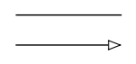
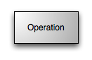
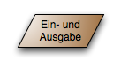

# Table of Content
- [Table of Content](#table-of-content)
- [Programmablaufplan (PAP)](#programmablaufplan-pap)
  - [Elemente](#elemente)

# Programmablaufplan (PAP)
[^1]
- Wird auch als Flussdiagramm (Flowchart) oder Programmsturkturplan bezeichnet
Die Grafische Darstellung eines Algorithmus in einem Programm und beschreibt die
- Folge von Operationen zur Lösung einer Aufgabe
- DIN 66001 für Datenflusspläne

## Elemente
- Kreis; Oval/Rechtek abgerundet: Terminator 

- Pfeil, Linie: Verbindung zum nächsten Element 

- Rechteck: Operation (Tätigkeit) 

- Rechteck mit doppelten, vertikalen Linien: Unterpogramm ausführen 

- Raute: Verzweigung / Entscheidung 

- Parallelogramm: Ein- und Ausgabe 

[^1]: https://de.wikipedia.org/wiki/Programmablaufplan