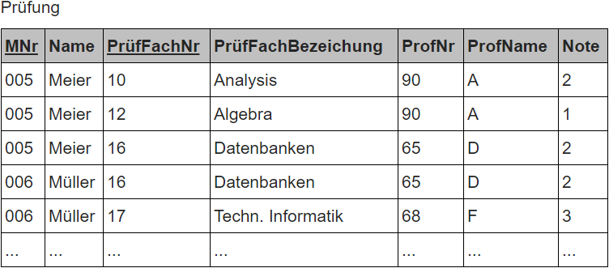
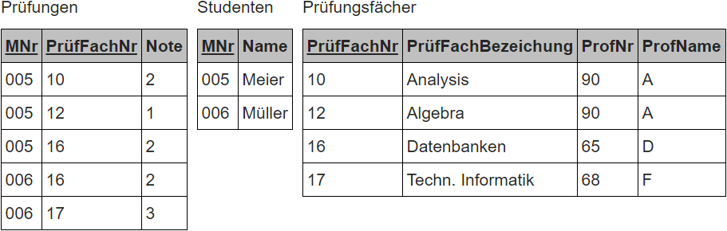
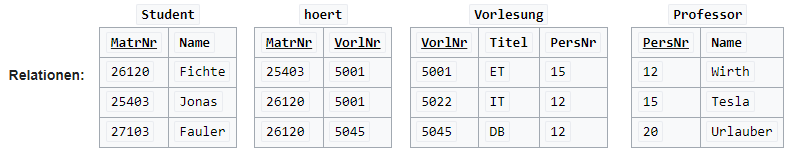

# Table of Content
- [Table of Content](#table-of-content)
- [Types of Databases](#types-of-databases)
  - [Relational Databases](#relational-databases)
  - [Document-Oriented Databases](#document-oriented-databases)
- [Normal Forms](#normal-forms)
  - [1st Normal Form](#1st-normal-form)
    - [Explanation](#explanation)
    - [Example](#example)
    - [Possible Errors](#possible-errors)
      - [Insertion Anomaly](#insertion-anomaly)
      - [Update Anomaly](#update-anomaly)
      - [Deletion Anomaly](#deletion-anomaly)
  - [2nd Normal Form](#2nd-normal-form)
    - [Explanation](#explanation-1)
    - [Example](#example-1)
    - [Possible Errors](#possible-errors-1)
      - [Update Anomaly](#update-anomaly-1)
  - [3rd Normal Form](#3rd-normal-form)
    - [Explanation](#explanation-2)
    - [Example](#example-2)
    - [Possible Errors](#possible-errors-2)
- [Relationships](#relationships)
  - [1:1 Relationship](#11-relationship)
  - [1:n Relationship](#1n-relationship)
  - [n:m Relationship](#nm-relationship)
- [SQL](#sql)
  - [Language Elements](#language-elements)
  - [SELECT queries](#select-queries)
    - [Simple query](#simple-query)
    - [Query with column selection(,)](#query-with-column-selection)
    - [Query with unique values (DISTINCT)](#query-with-unique-values-distinct)
    - [Query with rename (AS)](#query-with-rename-as)
    - [Query with filter (WHERE)](#query-with-filter-where)
    - [Query with filter by content (WHERE ... LIKE ...)](#query-with-filter-by-content-where--like-)
    - [Query with filter and sorting (ORDER BY)](#query-with-filter-and-sorting-order-by)
    - [Query with joined tables (, and INNER JOIN)](#query-with-joined-tables--and-inner-join)
    - [Left outer join (LEFT OUTER JOIN)](#left-outer-join-left-outer-join)
    - [Grouping of Aggregate Functions (GROUP BY)](#grouping-of-aggregate-functions-group-by)
    - [Summary of a SELECT](#summary-of-a-select)
  - [INSERT queries (Inserting records)](#insert-queries-inserting-records)
  - [Updating records (UPDATE)](#updating-records-update)
  - [Deleting records (DELETE)](#deleting-records-delete)
  - [SQL Data Types](#sql-data-types)

---
<br>

# Types of Databases
## Relational Databases
Relational databases consist of tables, each table has columns and rows. In such a database, relationships can be formed using primary and foreign keys.

## Document-Oriented Databases
In a document-oriented database, data is not stored in tables as in relational databases but in documents. Such a document is a structured data source presented in a specific format, often as JSON (JavaScript Object Notation) or as XML (eXtensible Markup Language).

# Normal Forms
[^2] [^1]<br>
Currently common normal forms include:
- 1st Normal Form (1NF)
- 2nd Normal Form (2NF)
- 3rd Normal Form (3NF)
- Boyce-Codd Normal Form (BCNF) [Not discussed here]
- 4th Normal Form (4NF) [Not discussed here]
- 5th Normal Form (5NF) [Not discussed here]

## 1st Normal Form
### Explanation
Every attribute of the relation must have an atomic value range, and the relation must be free of repetitions. That means, only one value per data field is allowed.

### Example
__0th Normal Form__
<br>
<a href="https://info-wsf.de/Normalformen/">
  
</a>
<br>
In the above example, multiple data are stored in one data field. This is also called the 0th Normal Form or NF² (Non-First-Normal-Form).<br>
Records from this table cannot be individually retrieved. For example, if you want to get PrüfFachNr of Meier, you get "10", "12", and "16".
In the definition, it says "...maximum one value...", which allows you to enter null values in the 1st Normal Form, for example, if you have not yet assigned points in a course.
<br>

There are two ways to eliminate multiple attributes:
1. The multiple attribute is broken down into multiple single attributes within the record, i.e., the record gets more attributes.
2. If the multiple attribute contains a list of type-matching data, each value in the list is assigned its own record.

The result could look like this:
<br>
<a href="https://info-wsf.de/Normalformen/">
  
</a>
<br>

### Possible Errors
#### Insertion Anomaly
1. Another entry with a different exam subject is made to the existing exam number.
2. An entry with a different student name is made to the same matriculation number.
3. Entering a student who has not yet chosen a subject causes null values in the subject number, but since this is part of the primary key, it must not be. It violates integrity.

#### Update Anomaly
4. If the name of the professor changes, this must be done in all rows.
5. New examiners are assigned to individual exam subjects. Everywhere.

#### Deletion Anomaly
- Some data may be lost when a tuple is deleted.

## 2nd Normal Form
### Explanation
A relation is in the second normal form if the first normal form is achieved and no non-key attribute is functionally dependent on a proper subset of a candidate key.

### Example
We need to split the table from the first normal form example because neither the student's name nor the exam subject's name fully depends on the primary key. The attribute Note fully depends on the primary key and remains in the relation.<br>
So the following relations result in the second normal form.

<br>
<a href="https://info-wsf.de/Normalformen/">
  
</a>
<br>

In all resulting relations, all non-primary key attributes are fully functionally dependent on the respective primary keys.

### Possible Errors
#### Update Anomaly
4. If the name of the professor changes, this must be done in all rows.

## 3rd Normal Form
### Explanation
A relation is in the third normal form if the second normal form is satisfied and there are no dependencies between non-key attributes. Such dependencies are also referred to as transitive dependencies. Furthermore, attributes that are only indirectly dependent on the primary key must be moved to a new relation. This eliminates redundant data.

### Example
In the 3rd normal form, the dependency of the professor on the exam subject must be resolved.

<br>
<a href="https://info-wsf.de/Normalformen/">
  
</a>
<br>

### Possible Errors
- No errors known.

# Relationships
[^3]
## 1:1 Relationship
In a **"one-to-one" relationship in relational databases**, each record in table A is associated with exactly one record in table B and vice versa. This type of relationship should be avoided in modeling because most of the information related in this way can be in a table. A 1:1 relationship is only used to split a table due to its complexity or to isolate part of the table for access rights reasons.


## 1:n Relationship
A **"one to many" relationship in relational databases** is the most common type of relationship in a database. In a **1:many relationship**, a record in table A can have multiple matching records in table B, but a record in table B never has more than one record in table A associated with it.


## n:m Relationship
With **"many-to-many" relationships in relational databases**, each record in table A can have multiple matching records in table B, and vice versa. This relationship can only be realized via a third table, a connection table C. The connection table C usually only contains the foreign keys of the other two tables (A/B). The primary key of the connection table is formed from these two foreign keys. It follows that an m:n relationship is actually two 1:n relationships.


# SQL
[^4]
Structured Query Language (SQL) is a standard computer language for relational database management and data manipulation. Some of the key elements of SQL include:

## Language Elements
- Data Definition Language (DDL): 
  - Used to define the structure of the database.
- Data Manipulation Language (DML): 
  - Used to manipulate data within the database.
- Data Query Language (DQL):
  - Used to query the database for information.
- Data Control Language (DCL):
  - Used to control access to data within the database.
- Transaction Control Language (TCL):
   - Transaction control commands.

The term SQL refers to the English word “query”.

## SELECT queries
Example database:
<a href="https://de.wikipedia.org/wiki/SQL">
   
</a>

### Simple query

```sql
SELECT * FROM student;
```
Result:

|MatrNr|Name|
|---|---|
|26120|Fichte|
|25403|Jonas|
|27103|Fauler|

lists all columns and all rows of the `Student` table.

### Query with column selection(,)

```sql
SELECT LectureNo, Title FROM Lecture;
```
Result:

|LectureNo|Title|
|---|---|
|5001|ET|
|5022|IT|
|5045|DB|

lists all columns `LectureNo` and `Title` of all rows of the table `Lecture`.

### Query with unique values (DISTINCT)

```sql
SELECT DISTINCT MatrNr FROM listenes;
```
Result:

|MatrNr|
|---|
|25403|
|26120|

only lists different entries of the column `MatrNr` from the table `listenes`. This shows the matriculation numbers of all students who have at least one lecture, whereby matriculation numbers that occur multiple times are only displayed once.

### Query with rename (AS)

```sql
SELECT MatrNr AS MatriculationNumber, name FROM student;
```
Result:

|MatriculationNumber|name|
|---|---|
|26120|Fichte|
|25403|Jonas|
|27103|Fauler|

lists the columns `MatrNr` and `Name` of all rows of the table `Student`. `MatrNr` is listed as the `MatriculationNumber` in the display result.

### Query with filter (WHERE)

```sql
SELECT PrelNR, Title FROM Lecture WHERE Title = 'ET';
```
Result:

|TemplateNumber|Title|
|---|---|
|5001|ET|

lists the `VorlNr` and `Title` of all those rows in the table whose title is `ET`.

### Query with filter by content (WHERE ... LIKE ...)

```sql
SELECT Name FROM Student WHERE Name LIKE 'F%';
```
Result:

|Name|
|---|
|Fichte|
|Fauler|

lists the names of all students whose name begins with `F`. `LIKE` can be used with different wildcards: `_` stands for any single character, `%` stands for any character string.

### Query with filter and sorting (ORDER BY)

```sql
SELECT firstName, lastName, streetNumber, zipCode, city FROM Student WHERE zipCode = '20095' ORDER BY name;
```

ists the `firstName`, `name`, `streetNumber`, `zipCode` and `city` of all students from the specified zip code area in ascending order by `name`.

### Query with joined tables (, and INNER JOIN)

```sql
SELECT Lecture.LectureNo, Lecture.Title, Professor.PersNo, Professor.Name FROM Professor, Lecture WHERE Professor.PersNo = Lecture.PersNo;

```

The list behind `FROM` determines the data sources: at this point, using so-called `JOIN`s, several tables can be linked together so that data from different tables can be merged and displayed.

In this example, an “inner natural join” `(NATURAL INNER JOIN)` is used: All records from the tables `Professor` and `Lecture` that have the same value in the `PersNo` field. Professors without lectures and lectures without professors are therefore not displayed.

This query is equivalent to:

```sql
SELECT Lecture.LectureNo, Lecture.Title, Lecture.PersNo, Professor.Name FROM Professor INNER JOIN Lecture ON Professor.PersNo = Lecture.PersNo;
```

Tables can be linked not only via key fields, but also via any fields, as the following, technically nonsensical example shows

```sql
SELECT Lecture.Title, Professor.Name FROM Professor, Lecture WHERE Professor.Name <> Lecture.Title;
```
Result:

|Title|Name|
|---|---|
|ET|Tesla|
|ET|Wirth|
|ET|Urlauber|
|IT|Tesla|
|IT|Wirth|
|IT|Urlauber|
|DB|Tesla|
|DB|Wirth|
|DB|Urlauber|

The result contains the combinations of all professors and all lectures where the name of the professor differs from the title of the lecture - that is simply all of them (no lecture is named like a professor)

### Left outer join (LEFT OUTER JOIN)

```sql
SELECT Professor.PersNo, Professor.Name, Lecture.LectureNo, Lecture.Title FROM Professor LEFT OUTER JOIN Lecture ON Professor.PersNr = Lecture.PersNo;
```

Results in all records in the table `Professor` combined with the records in the table `Lecture`, each of which has the same value in the field `PersNo`. Professors without lectures are included, the lecture columns in the result then have the value `NULL`. Lectures without a professor are not included.

The following query only returns those data records for which there is no matching data record in the left outer group (all professors who do not give lectures):

```sql
SELECT Professor.PersNo, Professor.Name FROM Professor LEFT OUTER JOIN Lecture ON Professor.PersNo = Lecture.PersNo WHERE Lecture.PersNo IS NULL;
```

The same can be achieved using a subquery:

```sql
SELECT Professor.PersNo, Professor.Name FROM Professor WHERE NOT EXISTS (SELECT * FROM Lecture WHERE PersNo = Professor.PersNo);
```

### Grouping of Aggregate Functions (GROUP BY)

```sql
SELECT Professor.PersNo, Professor.Name, COUNT(Vorlesung.PersNo) AS Count FROM Professor LEFT OUTER JOIN Lecture ON Professor.PersNo = Vorlesung.PersNo GROUP BY Professor.Name, Professor.PersNo;
```

Counts the number of lectures per professor using the aggregate function `COUNT`.

Note: `COUNT(Professor.PersNo)` or `COUNT(*)` would be incorrect (NULL values should not be counted).

### Summary of a SELECT

**Explanation:**

- **DISTINCT:**
  - Specifies that duplicate result tuples should be removed from the result relation. Each record is output only once, even if it appears multiple times in the table. Otherwise, SQL returns a multiset.
- **Select list:**
  - Determines which columns from the source are to be output (* for all) and whether aggregate functions should be applied. Like all other enumerations, individual elements are separated by commas (,).
- **Source:**
  - Specifies where the data comes from. Relations and views can be specified and linked together as a Cartesian product or as a join (SQL-92 and later). By providing an additional name, relations can be renamed for the query.
- **WHERE clause:**
  - Specifies conditions, also known as filters, under which the data should be output. In SQL, subqueries can also be specified here, making SQL strictly relational complete.
- **GROUP BY attribute:**
  - Determines whether different values should be output as individual rows (GROUP BY = grouping) or whether the field values of the rows should be summarized by aggregations such as addition (`SUM`), average (`AVG`), minimum (`MIN`), maximum (`MAX`), resulting in a result value related to the grouping.
- **HAVING clause:**
  - Is like the `WHERE` clause, except that the specified condition relates to the result of an aggregation function, for example, `HAVING SUM (Amount) > 0`.
- **Sorting attribute:**
  - After `ORDER BY`, attributes are specified by which the data should be sorted. The default setting is `ASC`, which means ascending order, `DESC` is descending order.

**Set operators** can be applied to multiple `SELECT` queries that have the same number of attributes and where the data types of the attributes match:

- **UNION:**
  - Unites the result sets. In some implementations, duplicate result tuples are removed, as with `DISTINCT`, without needing to write or be allowed to write `UNION DISTINCT`.
- **UNION ALL:**
  - Unites the result sets. Duplicate result tuples are retained. Some implementations interpret `UNION` like `UNION ALL`, and they may not understand `ALL`, resulting in an error message.
- **EXCEPT:**
  - Returns the tuples that are in the first but not in the second result set. Duplicate result tuples are removed.
- **MINUS:**
  - An analogous operator to `EXCEPT`, used alternatively by some SQL dialects.
- **INTERSECT:**
  - Returns the intersection of two result sets. Duplicate result tuples are removed.

## INSERT queries (Inserting records)

```sql
INSERT INTO Lecture (LectureNo, Title, PersNo) VALUES (1000, 'Software Development 1', 12);
```

## Updating records (UPDATE)

```sql
UPDATE Lecture SET LectureNo = LectureNo + 1000, PersNo = 20 WHERE PersNo = 15;
```

Changes all records where PersNo has the value 15. The value of `LectureNo` is increased by 1000 and the value of PersNo is set to 20.

## Deleting records (DELETE)

```sql
DELETE FROM Lecture WHERE PersNo = 12;
```

Deletes all records where PersNo has the value 12.

## SQL Data Types

- **INTEGER:**
  - Integer (positive or negative), with names like `SMALINT`, `TINYINT`, or `BIGINT` used depending on the number of bits used.
- **NUMERIC(n, m) or DECIMAL(n, m):**
  - Fixed-point number (positive or negative) with a total of n digits, of which m are decimal places.
- **FLOAT(m):**
  - Floating-point number (positive or negative) with a maximum of m decimal places.
- **REAL:**
  - Floating-point number (positive or negative). The precision for this data type is defined by the database system.
- **DOUBLE or DOUBLE PRECISION:**
  - Floating-point number (positive or negative). The precision is defined by the database system.
- **FLOAT AND DOUBLE:**
  - Suitable for technical-scientific values and also include exponential notation. However, because they are stored in binary format, they are not suitable for monetary amounts because, for example, the value €0.10 (which corresponds to 10 cents) cannot be represented exactly.
- **CHARACTER (n) or CHAR (n):**
  - Character string text with n characters.
- **TEXT:**
  - Character string of arbitrary length (theoretically). In some systems, synonymous with `CLOB`.
- **DATE:**
  - Date without time information.
- **TIME:**
  - Time information (possibly including time zone).
- **TIMESTAMP:**
  - Timestamp (includes date and time; possibly including time zone), usually with millisecond resolution, sometimes even microsecond precision.
- **Boolean:**
  - Boolean variable (can take the values true or false or NULL). This data type is optional according to SQL:2003, and not all DBMS provide this data type.
- **BLOB(n) or BINARY LARGE OBJECT(n):**
  - Binary data of up to n bytes in length.
- **CLOB(n) or CHARACTER LARGE OBJECT(n):**
  - Character string of up to n characters in length.

[^1]: https://de.wikipedia.org/wiki/Normalisierung_(Datenbank)#Normalformen
[^2]: https://info-wsf.de/Normalformen/
[^3]: https://www.datenbanken-verstehen.de/datenmodellierung/beziehungen-datenbanken/
[^4]: https://de.wikipedia.org/wiki/SQL