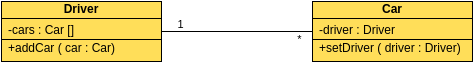
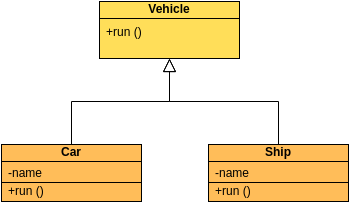
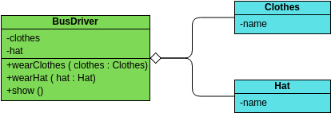

# Table of Content
- [Table of Content](#table-of-content)
- [Class Diagram](#class-diagram)
  - [Class](#class)
  - [Interface](#interface)
  - [Package](#package)
  - [Relationships](#relationships)
    - [Association](#association)
    - [Inheritance](#inheritance)
    - [Realization / Implementation](#realization--implementation)
    - [Dependency](#dependency)
    - [Aggregation](#aggregation)
    - [Composition](#composition)

# Class Diagram
[^1] 
A class diagram is a UML diagram type that describes a system by visualizing the different types of objects within a system and the kinds of static relationships that exist between them. It also illustrates the operations and attributes of the classes.

## Class

 
- Classes represent the central objects in a system. They are depicted by a rectangle with up to 3 compartments.
- The first one indicates the name of the class, while the middle one shows the attributes of the class, which are the features of the objects. The bottom one lists the operations of the class, representing the behavior of the class.

## Interface

 
- The interface symbol in class diagrams indicates a set of operations that would detail the responsibilities of a class.

## Package

 
- The package symbol is used to group classes or interfaces that are either of similar kind or related. Grouping these design elements using the enclosure symbols enhances the readability of the diagram.

## Relationships
[^2] 

 

### Association
- Association indicates that a property of one class contains a reference to an instance (or instances) of another class.
- There are several types of associations.
    - Binary association
    - Unidirectional association
    - Self-association
    - Multi-role association

__Example:__ 
Cars and drivers, a car corresponds to a specific driver, and a driver can drive multiple cars.
 

 
- In UML diagrams, bidirectional associations may have two arrows or no arrows, and unidirectional associations or self-associations have one arrow.
- In a multiplicity relationship, you can directly add a number to the associated line to specify the number of objects in the corresponding class
    - 1..1: Only one
    - 0..*: None or one
    - 1..*: One or more
    - 0..1: None or only one
    - m..n: At least m, at most n (m<=n)

### Inheritance
- __Inheritance__ is also called __Generalization__ and is used to describe the relationship between parent and child classes. A parent class is also referred to as a base class, and a subclass is also referred to as a derived class.
- The subclass inherits all functions of the parent class, and the parent class has all attributes, methods, and subclasses. Subclasses include additional information to the same information as the parent class.

__Example:__ 
Buses, taxis, and cars are all vehicles, they all have names, and they can all be on the road.
 

 

### Realization / Implementation
- __Implementation__ is mainly used to specify the relationship between interfaces and implementation classes.
- An interface (including an abstract class) is a collection of methods. In an implementation relationship, a class implements an interface, and methods in the class implement all methods of the interface declaration.

__Example:__ 
Cars and ships are vehicles, and the vehicle is just an abstract concept of a mobile tool, and the ship and the vehicle realize the specific mobile functions.
 

 

### Dependency
- Assume that a change in class A causes a change in class B, and then say that class B depends on class A.
In most cases, dependencies are reflected in methods of a class that use the object of another class as a parameter. 
- A dependency relationship is a "use" relationship. A change to a specific thing may affect other things that use it, and use a dependency when it is necessary to specify that one thing uses another.  

__Example:__ 
The car depends on gasoline. If there is no gasoline, the car cannot drive.
 

 

### Aggregation
- The relationship between the whole and a part can be separated.
- Aggregated relationships represent the relationship between the whole and a part of the class.
- A member object represents a part of the whole object, but it can also exist independently of the whole.  

__Example:__ 
Bus driver and work clothes are part of the overall relationship, but they can also exist independently. The given work clothes can be worn by the bus driver, but it can also be worn by something else.
 

 

### Composition
- The relationship between the whole and a part cannot be separated.
- The composition relationship represents the relationship between the whole and a part of the class, and the whole and the part have a consistent lifespan. Once the whole object no longer exists, some of the objects will also cease to exist.

__Example:__ 
A person consists of a head and a body. Both are inseparable and coexist.
 

[^1]: https://creately.com/blog/de/diagramme/uml-klassendiagramm/
[^2]: https://blog.visual-paradigm.com/de/what-are-the-six-types-of-relationships-in-uml-class-diagrams/
