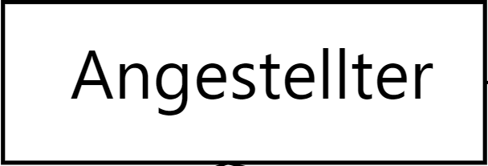

# Table of Content
- [Table of Content](#table-of-content)
- [Basic Components](#basic-components)
- [Notation Forms](#notation-forms)

[^1] 
The Entity-Relationship Model - abbreviated as ER model or ERM, is used to determine and represent the relevant portion of the real world within the context of semantic data modeling.

# Basic Components
- Entity: Typification of similar entities.
  - Example: Employee
  - 
- Relationship: Connection / Association between two or more entities.
  - Example: Employee __manages__
  - 
- Attribute: What is of interest about an entity (in context). These attributes identify.
  - Example: Name of the employee
  - 

# Notation Forms
The elements of relationships can be classified into various notation forms:
- Chen Notation
- IDEF1X
- Bachman Notation
- Martin Notation/Krähenfuß
- (min, max) Notation
- UML Standard

The most important three are:
- Chen Notation
- Martin Notation/Krähenfuß
- UML Standard

In the exam, you are allowed to choose the notation form.

[^1]: https://en.wikipedia.org/wiki/Entity%E2%80%93relationship_model
