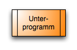

# Table of Content
- [Table of Content](#table-of-content)
- [Program Flowchart (PAP)](#program-flowchart-pap)
  - [Elements](#elements)

# Program Flowchart (PAP)
[^1]
- Also known as flowchart or program structure chart
- Graphical representation of an algorithm in a program, describing the
  - Sequence of operations to solve a task
  - DIN 66001 for data flow plans

## Elements
- Circle; Oval/Rounded Rectangle: Terminator 

- Arrow, Line: Connection to the next element 

- Rectangle: Operation (Activity) 

- Rectangle with double, vertical lines: Execute subprogram 

- Diamond: Branching / Decision 

- Parallelogram: Input and Output 

[^1]: https://en.wikipedia.org/wiki/Flowchart
