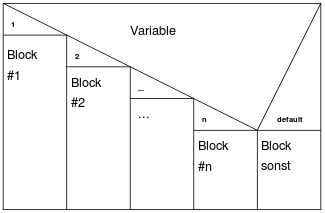

# Table of Content
- [Table of Content](#table-of-content)
- [Nassi-Shneidermann / Struktogramm](#nassi-shneidermann--struktogramm)
  - [Erklärung](#erklärung)
  - [Diagrammblöcke](#diagrammblöcke)
    - [Process Symbol](#process-symbol)
    - [Decision Symbol](#decision-symbol)
      - [1. Möglicher Block](#1-möglicher-block)
      - [2. Möglicher Block](#2-möglicher-block)
      - [Beispiel Verschachtelung](#beispiel-verschachtelung)
      - [Case-Statement](#case-statement)
    - [Schleifen](#schleifen)
      - [Iteration Symbol](#iteration-symbol)

# Nassi-Shneidermann / Struktogramm
[^1]
## Erklärung
Ein Nassi-Shneidermann-Diagramm ist ein Diagrammtyp zur Darstellung von Programmentwürfen im Rahmen der Methode der Strukturierten Programmierung. 

Da Nassi-Shneidermann-Diagramme Programmstrukturen und Kontrollstrukturen darstellen, werden sie auch als __Struktogramme__ bezeichnet.

## Diagrammblöcke
Die meisten der nachfolgenden Strukturblöcke können ineinander geschachtelt werden. Das aus den unterschiedlichen Strukturblöcken zusammengesetzte Struktogramm ist im Ganzen rechteckig, also genauso breit wie sein breitester Strukturblock.

### Process Symbol

- Jede Anweisung wird in einen rechteckigen Sturkturblock geschrieben. 
- Die Strukturblöcke werden nacheinander von oben nach unten durchlaufen. 
- Leere Strukturblöcke sind nur in Verzweigungen zulässig.
- Alternative Begriffe: Folge, Befehlsfolge, Anweisungsfolge, Anweisungsblock, Linearer Ablauf, Sequenz.

### Decision Symbol
Alternative Begriffe: Verzweigung, Alternative, Selektion
#### 1. Möglicher Block

- Nur wenn die Bedingung zutreffend ist, wird der Anweisungsblock 1 durchlaufen `(if)`. Trifft die Bedingung nicht zu, wird der Durchlauf ohne eine weiter Anweisung forgeführt (Austritt unten).
- Alternative Begriffe: Bedingte Verarbeitung, Einfache Auswahl/Selektion, Einfache Verzweigung.

#### 2. Möglicher Block

- Wenn die Bedingung Zutreffend ist, wir der erste Anweisungsblock durchlaufen. Tritt die Bedingung nicht zu, wird der zweite Anweisungsblock durchlaufen. `(if else)`
- Alternative Begriffe: Einfacher Alternative, Zweifache Auswahl, Alternative Verzweigung/verarbeitung.

#### Beispiel Verschachtelung

- Eine Verschachtelung ist im Ja und Nein Fall möglich.

#### Case-Statement

- Der Wert von __Variable__ kann bedingt auf Gleichheit aber auch auf Bereiche (größer/kleiner bei Zahlen) geprüft werden. Der entsprchend Zutreffende "Fall" mit dem zugehörigen Anweisungsblock wird durchlaufen (`switch`, `select`).
- Alternative Begriffe: Mehrfache Alternative, Fallauswahl, Mehrfachauswahl, Case, Select.

### Schleifen

#### Iteration Symbol

[^1]: https://de.wikipedia.org/wiki/Nassi-Shneiderman-Diagramm