# Table of Content
- [Table of Content](#table-of-content)
- [Programmablaufplan (PAP)](#programmablaufplan-pap)
  - [Elemente](#elemente)
  - 
- [Klassendiagramm](#klassendiagramm)
  - [Klasse](#klasse)
  - [Schnittstelle](#schnittstelle)
  - [Paket](#paket)
  - [Beziehungen](#beziehungen)
    - [Assoziation - Association](#assoziation---association)
    - [Vererbung - Inheritance](#vererbung---inheritance)
    - [Realisierung / Umsetzung - Realization / Implementation](#realisierung--umsetzung---realization--implementation)
    - [Abhängigkeit - Dependency](#abhängigkeit---dependency)
    - [Aggregation](#aggregation)
    - [Komposition - Composition](#komposition---composition)

---
 

# Programmablaufplan (PAP)
[^1]
- Wird auch als Flussdiagramm (Flowchart) oder Programmsturkturplan bezeichnet
Die Grafische Darstellung eines Algorithmus in einem Programm und beschreibt die
- Folge von Operationen zur Lösung einer Aufgabe
- DIN 66001 für Datenflusspläne

## Elemente
- Kreis; Oval/Rechtek abgerundet: Terminator 
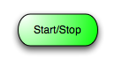
- Pfeil, Linie: Verbindung zum nächsten Element 
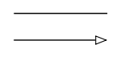
- Rechteck: Operation (Tätigkeit) 
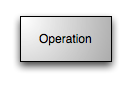
- Rechteck mit doppelten, vertikalen Linien: Unterpogramm ausführen 
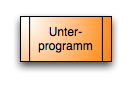
- Raute: Verzweigung / Entscheidung 
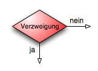
- Parallelogramm: Ein- und Ausgabe 

---

 

# Klassendiagramm
[^2] 
Ein Klassendiagramm ist ein UML-Diagrammtyp, der ein System beschreibt, indem er die verschiedene Objekttypen innerhalb eines Systems und die Arten der statischen Beziehungen, die zwischen ihnen bestehen, visualisiert. Sie veranschaulicht auch die Operation und Attribute der Klassen.

## Klasse
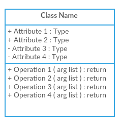
 
- Klassen stellen die zentralen Objekte in einem System dar. Sie wird durch ein Rechteck mit bis zu 3 Fächern dargestellt.
- Die erste zeigt den Namen der Klasse, während die mittlere die Attribute der Klasse zeigt, die die Merkmale der Objekte sind. Die untere listet die Operationen der Klasse auf, die das Verhalten der Klasse darstellt.

## Schnittstelle
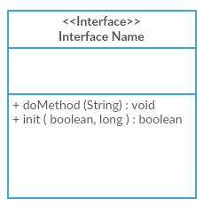
 
- Das Schnittstellensymbol in Klassendiagrammen zeigt eine Reihe von Operationen an, die die Verantwortung einer Klasse detailliert beschreiben würde.

## Paket
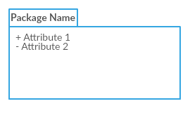
 
- Das Paketsymbol wird verwendet, um Klassen oder Schnittstellen zu gruppieren, die entweder von ähnlicher Art oder verwandt sind. Die Gruppierung dieser Entwurfselemente mit Hilfe der Gehäusesymbole verbessert die Lesbarkeit des Diagramms.

## Beziehungen
[^3] 
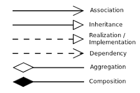
 

### Assoziation - Association
- Die Assoziation gibt an, dass eine Eigenschaft einer Klasse einen Verweis auf eine Instanz (oder Instanzen) einer anderen Klasse enthält.
- Es gibt mehrere Arten der Assoziation.
    - Zweigassoziation
    - Einwegassoziation
    - Selbstassoziation
    - Merfachnummernassoziation

__BSP:__ 
Autos und Fahrer, ein Auto entspricht einem bestimmten Fahrer und ein Fahrer kann mehrere Autos fahren.
 
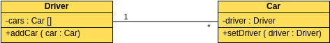
 
- In UML-Diagrammen können bidirektionale Assoziationen zwei Pfeile oder keine Pfeile haben und unidirektionale Assoziationen oder Selbstassoziationen haben einen Pfeil.
- In einer Multiplizitätsbeziehung können Sie der zugehörigen Zeile direkt eine Zahl hinzufügen, um die Anzahl der Objekte in der entpsrechenden Klasse anzugeben
    - 1..1: Nur eine
    - 0..*: Null oder eine
    - 1..*: ein oder mehr
    - 0..1: Nein oder nur eins
    - m..n: mindestens m, höchstens n (m<=n)

### Vererbung - Inheritance
- __Vererbung__ wird auch __Generalisierung__ genannt und wird verwendet, um die Beziehung zwischen Eltern- und Kindklassen zu beschreiben. Eine übergeordnete Klasse wird auch als Basisklasse bezeichnet und eine Unterklasse wird auch als abgeleitete Klasse bezeichnet.
- Die Unterklasse erbt alle Funktionen der Elternklasse, und die Elternklasse hat alle Attribute, Methoden und Unterklassen. Unterklassen enthalten zusätzliche Informationen zu den gleichen Informationen wie die übergeordnete Klasse.

__BSP:__ 
Busse, Taxen und Autos sind Autos, sie alle haben Namen und sie können alle auf der Straße sein.
 
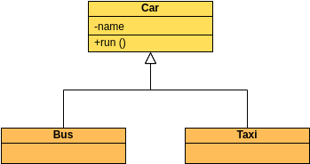
 

### Realisierung / Umsetzung - Realization / Implementation
- __Implementierung__ (Implementation) wird hauptsächlich verwendet, um die Beziehung zwischen Schnittstellen und Implementierungsklassen zu spezifizieren.
- Eine Schnittstelle (einschließlich einer abstrakten Klasse) ist eine Sammlung von Methoden. In einer Implementierungsbeziehung implementiert eine Klasse eine Schnittstelle, und Methoden in der Klasse implementieren alle Methoden der Schnittstellendeklaration.

__BSP:__ 
Autos und Schiffe sind Fahrzeuge, und das Fahrzeug ist nur ein abstraktes Konzept eines mobilen Werkzeugs, und das Schiff und das Fahrzeug realisieren die spezifischen mobilen Funktionen.
 
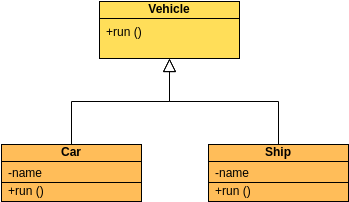
 

### Abhängigkeit - Dependency
- Nehmen Sie an, dass eine Änderung in Klasse A eine Änderung in Klasse B verursacht, und sagen Sie dann, dass Klasse B von Klasse A abhängt.
In den meisten Fällen spiegeln sich Abhängigkeiten in Methoden einer Klasse wieder, die das Objekt einer anderen Klasse als Parameter verwenden. 
- Eine Abhängigkeitsbeziehung ist eine "Nutzung"-Beziehung. Eine Änderung an einem bestimmten Ding kann sich auf andere Dinge auswirken, die es verwenden, und eine Abhängigkeit verwenden, wenn angegeben werden muss, dass ein Ding ein anderers verwendet.  

__BSP:__ 
Das Auto ist auf Benzin angewiesen. Wenn kein Benzin vorhanden ist, kann das Auto nicht fahren.
 
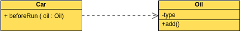
 

### Aggregation
- Die Beziehung zwischen dem Ganzen und einem Teil kann getrennt werden.
- Aggregierte Beziehungen stellen die Beziehung zwischen dem Ganzen und einem Teil der Klasse dar.
- Ein Mitgliedsobjekt stellt ein Teil des Gesamtobjekts dar, kann aber auch unabhängig vom Ganzen existieren.  

__BSP:__ 
Busfahrer und Arbeitskleidung sind Teil der Gesamtbeziehung, aber sie können auch unabhängig voneinander existieren. Die gegeben Arbeitskleidung kann vom Busfahrer getragen werden, es kann aber auch was anders getragen werden.
 
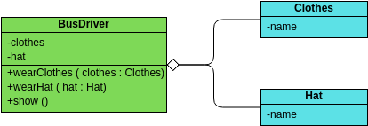
 

### Komposition - Composition
- Die Beziehung zwischem dem Ganzen und einem Teil kann __nicht__ getrennt werden.
- Die Kombinationsbeziehung stellt die Beziehung zwischen dem Ganzen und einem Teil der Klase dar, und das Ganze und der Teil haben eine konsistente Lebensdauer. Sobald das Gesamtobjekt nicht mehr existiert, werden einiger der Objekte auch nicht mehr existieren.

__BSP:__ 
Eine Person besteht aus einem Kopf und einem Körper. Beide sind unzertrennlich und koexistieren.
 
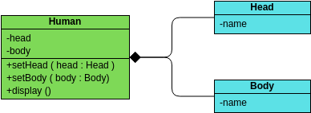

[^1]: https://de.wikipedia.org/wiki/Programmablaufplan
[^2]: https://creately.com/blog/de/diagramme/uml-klassendiagramm/
[^3]: https://blog.visual-paradigm.com/de/what-are-the-six-types-of-relationships-in-uml-class-diagrams/