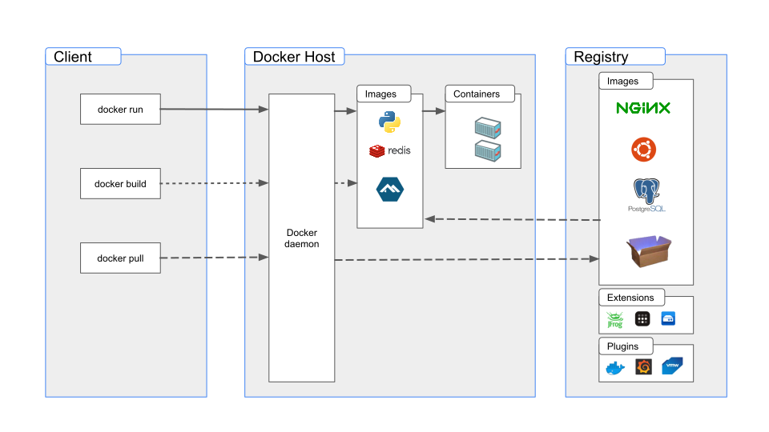

# Table of Content
- [Table of Content](#table-of-content)
- [Docker vs VM](#docker-vs-vm)
  - [Docker](#docker)
  - [Virtual Machine](#virtual-machine)
  - [Kurz erklärt](#kurz-erklärt)
- [Weiteres zu Docker](#weiteres-zu-docker)
  - [Grundlagen](#grundlagen)
  - [Begriffe](#begriffe)
    - [Image](#image)
    - [Container](#container)
    - [Layer](#layer)
    - [Dockerfile](#dockerfile)
    - [Repository](#repository)
    - [Registry](#registry)
  - [Aufsetzen eines Dockers unter Linux (Ubuntu)](#aufsetzen-eines-dockers-unter-linux-ubuntu)
    - [Setup vom Repository](#setup-vom-repository)
    - [Installieren von Docker Engine](#installieren-von-docker-engine)
- [Hypervisor](#hypervisor)

# Docker vs VM

## Docker
Ein Docker Container teilt sich den Kernel des Hostsystems, wodurch mehrere isolierte Anwendungen auf einem einzigen Betriebssystem laufen können.

## Virtual Machine

Eine VM ist ein komplettes eigenes Betriebssystem oder Gastbetriebssystem auf einem Hostbetriebssystem. Ressourcen wie Prozessor, Speicher und Netzwerke werden auf die VM verteilt.

## Kurz erklärt

VMs stellen eine Vollständige Virtualisierung, bei der ein eigenständiges Betriebssystem in einem isoliertem Umfeld läuft.  
Docker-Container bieten eine leichtgewichtige, anwendungsbasierte Virtualisierung bei der Anwendungen in isolierten Containern ausgeführt werden.  
Die Wahl zwischen den Beiden hängt von den Spezifischen Anforderungen, dem Ressourcenverbrauch und der Portabilität der Anwendung ab.

# Weiteres zu Docker
[^6] [^9]  
Docker ist eine freie Software zur Isolierung von Anwendungen mit Hilfe von Containervirtualisierung.

Docker vereinfacht die Bereitstellung von Anwendungen, weil sich Container, die alle nötigen Pakete enthalten, leicht als Dateien transportieren und installieren lassen. Container gewährleisten die Trennung und Verwaltung der auf einem Rechner genutzten Ressourcen. Das umfasst laut Aussage der Entwickler: Code, Laufzeitmodul, Systemwerkzeuge, Systembibliotheken – alles was auf einem Rechner installiert werden kann.

<br>
[^8]

## Grundlagen
Docker basiert auf Linux-Techniken wie __Cgroups__ und __Namespaces__, um Container zu realisieren. Während anfänglich noch die LXC-Schnittstelle des Linux-Kernels verwendet wurde, haben die Docker-Entwickler mittlerweile eine eigene Programmierschnittstelle namens __libcontainer__ entwickelt, die auch anderen Projekten zur Verfügung steht.

Normalerweise sind Docker auf die Virtualisierung mit Linux ausgerichtet, können aber auch mittels __HyperV__ oder __Virtualbox__  auf Windows oder mit __HyperKit__ oder __VirtualBox__ auf macOs verwendet werden.

## Begriffe
### Image
Ein Speicherabbild eines Containers. Das Image selbst besteht aus mehreren Layern, die schreibgeschützt sind und somit nicht verändert werden können. Ein Image ist portabel, kann in Repositories gespeichert und mit anderen Nutzern geteilt werden. Aus einem Image können immer mehrere Container gestartet werden.

### Container
Als Container wird die aktive Instanz eines Images bezeichnet. Der Container wird also gerade ausgeführt und ist beschäftigt. Sobald der Container kein Programm ausführt oder mit seinem Auftrag fertig ist, wird der Container automatisch beendet.

### Layer
Ein Layer ist ein Teil eines Images und enthält einen Befehl oder eine Datei, die dem Image hinzugefügt wurde. Anhand der Layer kann die ganze Historie des Images nachvollzogen werden.

### Dockerfile
Eine Textdatei, die mit verschiedenen Befehlen ein Image beschreibt. Diese werden bei der Ausführung abgearbeitet und für jeden Befehl wird ein einzelnes Layer angelegt.

### Repository
Ein Repository ist ein Satz gleichnamiger Images mit verschiedenen Tags, zumeist Versionen.

### Registry
Eine Registry, wie zum Beispiel __Docker Hub__ oder __Artifactory__, dient der Verwaltung von Repositories.

## Aufsetzen eines Dockers unter Linux (Ubuntu)
[^7]

### Setup vom Repository
1. "Update the __apt__ package index and install packages to allow apt to use a repository over HTTPS:"

    ```sh
    $ sudo apt update
    ```

    ```sh
    $ sudo apt-get install \
     ca-certificates \
     curl \
     gnupg \
     lsb-release 
    ```

2. "Add Docker’s official GPG key:"

    ```sh
    $ sudo mkdir -m 0755 -p /etc/apt/keyrings
    $ curl -fsSL https://download.docker.com/linux/ubuntu/gpg | sudo gpg --dearmor -o /etc/apt/keyrings/docker.gpg
    ```

3. "Use the following command to set up the repository:"
    ```sh
    $ echo \
     "deb [arch=$(dpkg --print-architecture) signed-by=/etc/apt/keyrings/docker.gpg] https://download.docker.com/linux/ubuntu \
     $(lsb_release -cs) stable" | sudo tee /etc/apt/sources.list.d/docker.list > /dev/null
    ```

### Installieren von Docker Engine
1. "Update the package index:"
    ```sh 
    $ sudo apt-get-update
    ```
2. "Install Docker Engine, containerd, and Docker Compose:"
    ```sh
    $ sudo apt-get install docker-ce docker-ce-cli containerd.io docker-buildx-plugin docker-compose-plugin
    ```

3. "Verify that the Docker Engine is successful by running `hello-world` image:"
    ```sh
    $ sudo docker run hello-world
    ```


# Hypervisor
[^5]
Hypervisor oder auch Virtual-Machine-Monitor (VMM) ist die Bezeichnung für eine Klasse von Systemen der praktischen Informatik, die als abstrahierende Schicht zwischen tatsächlich vorhandener Hardware und weiteren zu installierenden Betriebssystemen dient.

Ein Hypervisor erlaubt den simultianen Betrieb von mehreren Gastsystemen auf einem Hostsystem. Der Hypervisor verwaltet die Ressourcenzuteilung für einzelne Gastsysteme.

[^5]: https://de.wikipedia.org/wiki/Hypervisor
[^6]: https://de.wikipedia.org/wiki/Docker_(Software)
[^7]: https://docs.docker.com/engine/install/ubuntu/
[^8]: https://docs.docker.com/assets/images/architecture.svg
[^9]: https://docs.docker.com/get-started/overview/